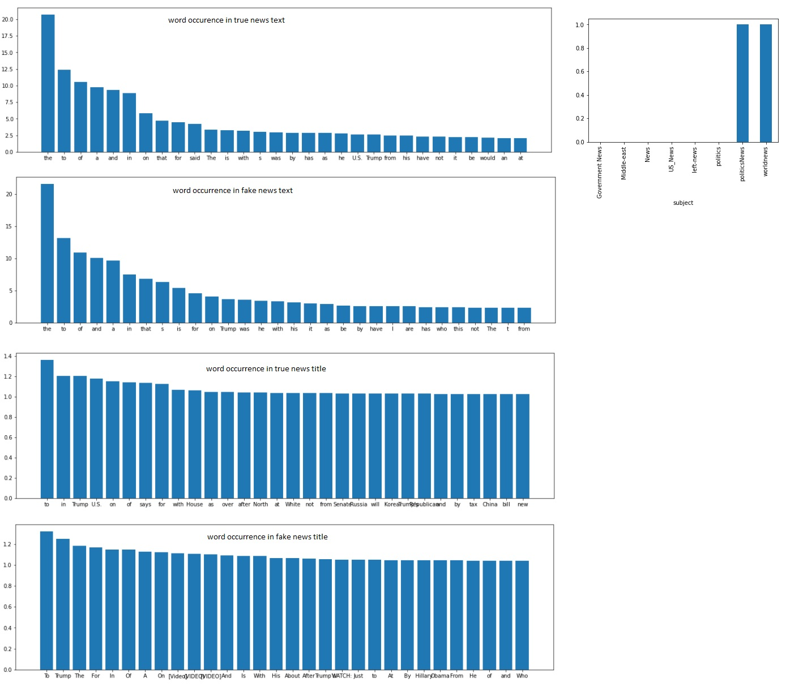

# DSC_ExamProject
## Authors:
Martin Høigaard Cupello
Kenneth Leo Hansen
Frederik Blem
Simon Bojesen

# Stage 1:
## Idea 1 : Kidney disease prediction
### Focus of interest:
To detect possibility of chronic kidney disease given certain parameters.
### Why is it interesting:
It will  help to discover the sickness early and therefore enable treatment at an early stage. Or in preventative medicine.
### Which outcome do you expect from your research:
To create a model which will be able to a high degree of success to predict if a person is sick with chronic kidney disease.
### Who will the user be:
A docter or other medical staff.

## Idea 2 : Fake news detection
### Focus of interest:
There is a huge amount of fake news articles on the internet. This will help discover them, so they can be avoided.
### Why is it interesting:
It is interesting because it will enable you to only get "true" news to a certain degree.
### Which outcome do you expect from your research:
A model which can be used when for example scraping the internet for articles and collect "true" news.
### Who will the user be:
Facebook, twitter and so on.

## Idea 3 : Closed eyes facial recognition for sleepy drivers alert
### Focus of interest:
To prevent drivers from falling asleep while driving.
### Why is it interesting:
It will prevent some accidents from occuring.
### Which outcome do you expect from your research:
An ai which can determine if the person in the image/video has his eyes closed, and then play an alert if that is the case.
### Who will the user be:
Occupational truck drivers for example.

# Stage 2

## 1. All of the relevant  datasets are stored in the Data folder.

##  Kidney disease prediction
### Part 2 ELT and part 3 Data processing scenario 
[Click here to see part 2 & 3 of Kidney Disease](Python/kidneyNotebook.ipynb)

#  Fake News Detection

[Notebook](Python/NewsPrediction.ipynb)

## Closed eyes facial recognition for sleepy drivers alert
