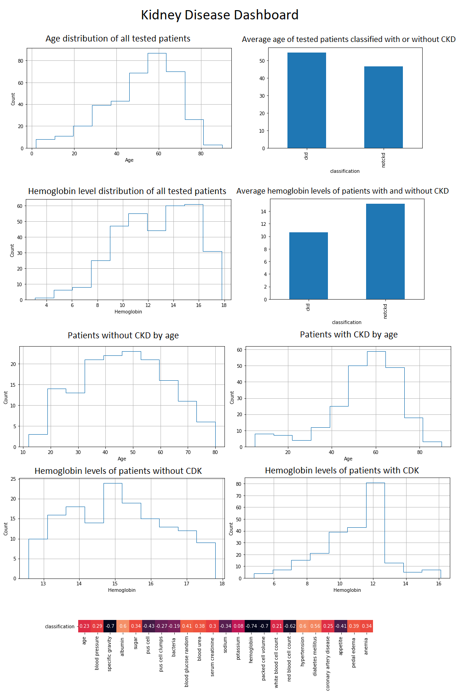
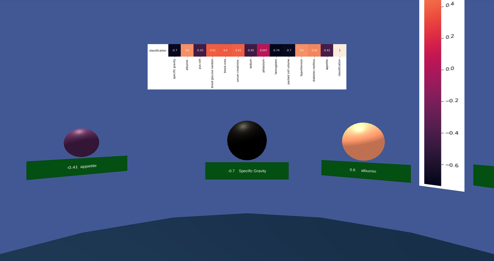
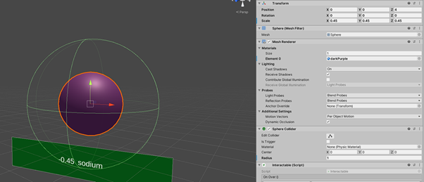
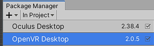

# Chronic Kidney Disease detection
## Problem Objectives
The problem that we want to solve is that many cases of Chronic Kidney Disease go undetected around the globe. We would solve this using machine learning, by getting a lot of information from a blood test, and training a model to correctly classify if a person has the disease or not. 
We want the final model to have an error rate of under 5%.

## Motivation
The motivation for the choice of Chronic Kidney Disease detection was that we wanted to choose a relevant case, meaning: something that, if developed correctly, could be used to save lives. In the beginning of the project planning phase we had chosen 3 subjects we wanted to look at before finally choosing one of them: fake news detection, sleeping driver detection, and chronic kidney disease detection. The idea of fake news was scrapped after discussion, as we wanted the chosen idea to have a real impact. First, we wanted to do the one about detecting if a driver was sleeping, and then develop some alarm or way to wake him up. The initial results that we got were not great and detecting closed eyes in a video was a problem compared to open eyes. So we tried our hands at the last idea, and found more initial success.

## Theoretical Foundation
Chronic Kidney disease is a condition that affects around 10% of the entire global adult population. The problem with chronic kidney disease is that it goes undetected for very long periods of time, for example: just in the US, 90% of the people that have ckd don’t know they have it. Chronic kidney disease is when your kidneys are damaged, and they have lost the ability to filter your blood. When the disease gets worse, more things will start to happen that makes the disease more dangerous. These things include amenia, nerve damage, high blood pressure, and weak bones. All of these things may lead to kidney failure, and if that happens the affected person will die, unless they get a kidney transplant. 

The main causes of chronic kidney disease include high blood pressure and diabetes. Other factors such as age, smoking, older age and heart and blood vessel disease, are also risk factors and may lead to chronic kidney disease.

The best treatment for chronic kidney disease is to detect it early on. This way you can begin to prevent further stages of it by making lifestyle changes and taking medicine for the symptoms.

Otherwise if detected at a later stage a dialysis or transplant would be needed in many such cases.

Sources:  
https://www.nhs.uk/conditions/kidney-disease/treatment/ 
https://www.kidney.org/news/newsroom/fsindex 
https://www.kidney.org/kidneydisease/global-facts-about-kidney-disease  
https://www.mayoclinic.org/diseases-conditions/chronic-kidney-disease/symptoms-causes/syc-20354521

## Argumentation of Choices
We decided to test with several models, as there is no distinct model which is better than all the others, it all depends on the dataset.
 
We converted outliers to means instead of dropping them, as dropping them would lead to a small dataset. We determined outliers as those that were more than three standard deviations away from the mean (three sigma rule). 

https://en.wikipedia.org/wiki/68%E2%80%9395%E2%80%9399.7_rule

We decided to test using the following classification models: KNN, Gaussian Naive Bayes, Multinomial Naive Bayes and Decision Tree, as these were some we had previous experience with.

After we had tested the model and got some good accuracy scores, we still wanted to improve the models. In order to do this we decided to use the heat map, to remove the columns that had the least significant impact on the classification, because we wanted to clean the data from noise. 

We decided to compare with newly created data that was generated randomly, because we wanted to see how the models performed with new data. It was not a good idea, since most of the features in the dataset are correlated.

We then decided to test with a validation sample with a size of 25, taken from the dataset before any models were trained. We used this for a final comparison between the different iterations of models, to see if our model was actually able to determine if a person has chronic kidney disease. After we were sure that our model could do this we exported the best performing model.

## Outcomes
In the end we were able to create a model by using a decision tree that had an accuracy of 99%. With such a high accuracy rate the model is able to predict chronic kidney disease, given the correct information. This means the model is ready to use, and can be used in actual medical application. 

## Implementation Instructions
In development

# Descriptions of work and ideas from the 5 stages
## Stage 1:
### Idea 1 : Kidney disease prediction
#### Focus of interest:
To detect possibility of chronic kidney disease given certain parameters.
#### Why is it interesting:
It will  help to discover the sickness early and therefore enable treatment at an early stage. Or in preventative medicine.
#### Which outcome do you expect from your research:
To create a model which will be able to a high degree of success to predict if a person is sick with chronic kidney disease.
#### Who will the user be:
A docter or other medical staff.

### Idea 2 : Fake news detection
#### Focus of interest:
There is a huge amount of fake news articles on the internet. This will help discover them, so they can be avoided.
#### Why is it interesting:
It is interesting because it will enable you to only get "true" news to a certain degree.
#### Which outcome do you expect from your research:
A model which can be used when for example scraping the internet for articles and collect "true" news.
#### Who will the user be:
Facebook, twitter and so on.

### Idea 3 : Closed eyes facial recognition for sleepy drivers alert
#### Focus of interest:
To prevent drivers from falling asleep while driving.
#### Why is it interesting:
It will prevent some accidents from occuring.
#### Which outcome do you expect from your research:
An ai which can determine if the person in the image/video has his eyes closed, and then play an alert if that is the case.
#### Who will the user be:
Occupational truck drivers for example.

## Stage 2

### 1. All of the relevant  datasets are stored in the Data folder.

### 2. ELT/ETL and part 3 Data processing scenario 

###  Kidney disease prediction
[Notebook](Python/kidneyNotebook.ipynb)
 
#### Datastory:
With the data we have gathered we will try to find out which columns is a factor when detecting chronic kidney disease. With the data we have visualised we can see that hemoglobin is a very important factor when diagnosing ckd. We can also see that the older you get the higher chance of being diagnosed with chronic kidney disease.

On the dashboard can be seen different plots of data from the dataset.
On the first histogram plot it can be seen the age distribution of all the tested patients. On the second plot it is then shown how age is a factor in the likelyhood of getting CKD, by showing the average age of patients who was classified as having CKD and also for the patients who did not have it.

On the second row of plots the same thing is shown, not for the age, but for the hemoglobin levels tested in patients blood samples and how these levels relate to the classification.

The heat vector here shows all the datasets features and scores how much they relate to the classification of the patients. The further from 0 they score, the bigger the impact, meaning the feature has more say to the classification then others.

### Fake News Detection

[Notebook](Python/NewsPrediction.ipynb)

#### Dashboard

#### Datastory
The idea is to find word occurrences in the articles, and from these, determine if an article is true or fake news.

In the figure on the right we can see that most articles with the subject "politicsNews" or "worldnews" fall in the category of true news, where the mean for the other subjects are fake news. It does not mean that fake news cannot have a subject of politicsNews for example, just that the average does not.

The word occurrence figures show how many times a given word appears in the text/title. There is a lot of similarities found here for common words, but there is a few that stands out, for example in the word occurrence for fake news title, the word "Video" and "Watch" appears in this toplist, where it does not appear in the true news.

### Closed eyes facial recognition for sleepy drivers alert

## Stage 3
We choose to go with the chronic kidney disease project. The AI is created in the notebook.

### AI Module
To create the AI Module we have split the data into 70% training data and 30% test data.
By testing different machine learning algorithms, we created a model that provides 98,28% accuracy when diagnosing a patient with chronic kidney disease or not.
In our tests the inaccuracy resulted only finding false negatives with an error rate of 3% when determining if a person has chronic kidney disease. Also during our tests there were no false positives, which means it has a 100% accuracy when determining if a patient does not have chronic kidne disease. 

## Stage 4
We have created our HeatMap in VR with color and size coding of the different features, depending on the impact on the classification. Here is the link to the video, click view raw to download:
[video](Images/virtualReality/DSC_VRSpheres.mp4)

<b><em>Elaborate on the benefits of applying better visualisation techniques for data analytics:</em></b>

It increases the engagement and understanding of the target audience, rather then showing raw data, enabling them, who has no prior knowledge of data science, to make decisions.

One important aspect of better visualisation is that it enables better overview of corrolation between the features in the data. It also helps with the understanding of the data that the model is based on.

One of the benefits of visualisation is to see trends over time, providing a basis to be able to make predictions. In order to make predictions you need to be able to see what has happened in the past and present, enabling you to predict the future.

About the scene:
The VR scene depicts the heat vector with its values and “weight colour scale” to enable the consumer to get an understanding of the visualization.
Every sphere’s diameter is their positive difference from 0 as depicted through their scale values.  This means that the sodium sphere has a visualized diameter of 0.45 meters and it’s “weight colour” corresponds to its entry in the heat vector.

VR SDK’s:
The Unity project uses the SDK’s for “Oculus Desktop” and “OpenVR Desktop” in the 2019.3.0f6 version of Unity to provide Virtual Reality functionality with Oculus headsets and those compatible with SteamVR such as Vive, Valve Index and Windows Mixed Reality headsets.
The build of the project is targeted towards 64Bit Windows machines.

# Authors:
- Martin Høigaard Cupello
- Kenneth Leo Hansen 
- Frederik Blem
- Simon Bojesen

